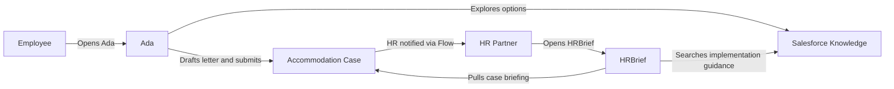
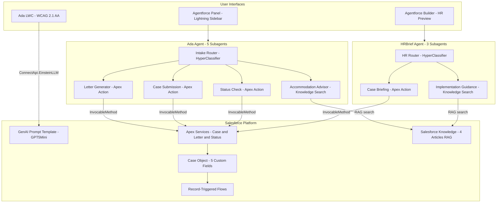

# Advocate

**Agentforce for Good — Dreamforce 2026 Hackathon**

A dual Agentforce system that transforms workplace accommodation requests — making them faster, more dignified, and fully auditable for both employees and HR.

---

## What It Does

**Ada** — the employee-facing agent — guides employees through the accommodation process at their own pace: exploring options, drafting a professional advocacy letter, submitting a Case, and checking on its status. Accessible via the native Agentforce panel in Lightning Experience and a purpose-built WCAG 2.1 AA-compliant LWC chat interface.

**HRBrief** — the HR partner agent — gives HR teams the context they need to act: plain-language case briefings pulled directly from Salesforce, implementation guidance from company Knowledge, and status tracking — without surfacing unnecessary personal detail.

---

## How It Works — Functional View



---

## Architecture — Technical View



---

## Stack

| Layer | Technology |
|---|---|
| Agents | Agentforce `aiAuthoringBundle` / `.agent` DSL |
| Actions | Apex `@InvocableMethod` (3 services) |
| Knowledge | Salesforce Knowledge + Data Cloud (RAG) |
| UI | Lightning Web Components (WCAG 2.1 AA) |
| AI — LWC | Einstein GenAI Prompt Template (`sfdc_ai__DefaultGPT5Mini`) |
| AI — Agents | Einstein HyperClassifier (routing) + org-default LLM (subagents) |
| Automation | Record-Triggered Flows (2) |
| Data model | Case (5 custom fields, 1 custom Record Type) |
| Deploy | Salesforce CLI `sf` v2 |

---

## WCAG 2.1 AA Compliance (Ada LWC)

| Criterion | Implementation |
|---|---|
| 2.4.1 Bypass Blocks | Skip navigation link to main conversation |
| 4.1.3 Status Messages | `aria-live="polite"` region announces all responses |
| 1.4.3 Contrast | High contrast toggle (black/yellow, ≥4.5:1) |
| 1.4.4 Resize Text | Font scaling 14px–22px via A−/A+ controls |
| 2.1.1 Keyboard | Full keyboard nav; Enter to send, Shift+Enter for newline |
| 2.3.3 Animation | `prefers-reduced-motion` disables typing indicator |
| 2.4.7 Focus Visible | 3px `:focus-visible` outlines on all interactive elements |

---

## Project Structure

```
force-app/main/default/
├── aiAuthoringBundles/
│   ├── Ada/                              # Employee accommodation agent
│   └── HRBrief/                          # HR partner briefing agent
├── classes/
│   ├── AccommodationCaseService.cls      # Create Accommodation Case
│   ├── AccommodationLetterService.cls    # Generate Advocacy Letter
│   └── AccommodationStatusService.cls   # Get Accommodation Case Status
├── flows/
│   ├── AccommodationRequest_HRNotification.flow-meta.xml
│   └── AccommodationRequest_StatusUpdate.flow-meta.xml
├── genAiFunctions/                       # Agentforce Action registrations
├── genAiPromptTemplates/                 # Ada LWC prompt template
├── lwc/
│   └── adaAccommodationChat/            # WCAG 2.1 AA chat wrapper
└── objects/Case/
    ├── fields/                           # 5 custom fields
    └── recordTypes/Accommodation_Request.recordType-meta.xml
```

---

## Deployment

### Prerequisites

1. Salesforce org with Einstein and Agentforce Agents enabled
2. Salesforce CLI `sf` v2 installed
3. Data Cloud provisioned (required for Knowledge RAG)
4. Org authenticated: `sf org login web --alias advocate-org`

> On machines with corporate SSL inspection, prefix all `sf` commands with `NODE_TLS_REJECT_UNAUTHORIZED=0`.

### Deploy

```bash
# Deploy everything: data model, Apex, Flows, LWC, agents, prompt template
NODE_TLS_REJECT_UNAUTHORIZED=0 sf project deploy start \
  --source-dir force-app/main/default \
  --target-org advocate-org
```

### Post-deploy steps (required)

1. **Register Agentforce Actions** (Setup → Agentforce → Agent Actions → New):
   - `Create Accommodation Case` → `AccommodationCaseService`
   - `Generate Advocacy Letter` → `AccommodationLetterService`
   - `Get Accommodation Case Status` → `AccommodationStatusService`

2. **Activate the prompt template** (Setup → Prompt Builder → Ada Accommodation Chat → Activate)

3. **Activate both agents** (Agentforce Studio → each agent → Commit Version → Activate)

4. **Add Ada LWC to a Lightning page** (App Builder → drag `adaAccommodationChat` component)

---

## Key Technical Notes

### Agentforce Action source naming

The `source` field in the `.agent` DSL maps to the Agentforce Action developer name — not the raw Apex class name:

| @InvocableMethod label | source value |
|---|---|
| `Create Accommodation Case` | `Create_Accommodation_Case` |
| `Generate Advocacy Letter` | `Generate_Advocacy_Letter` |
| `Get Accommodation Case Status` | `Get_Accommodation_Case_Status` |

### bundle-meta.xml

Do NOT include a `<target>` element in `AiAuthoringBundle` bundle-meta.xml files — it causes a deploy error.

### GenAI Prompt Template

Do NOT include `<versionIdentifier>` in the template XML — Salesforce generates it internally. After deploy, the template must be manually activated in Prompt Builder before it can be invoked.

---

## License

MIT
